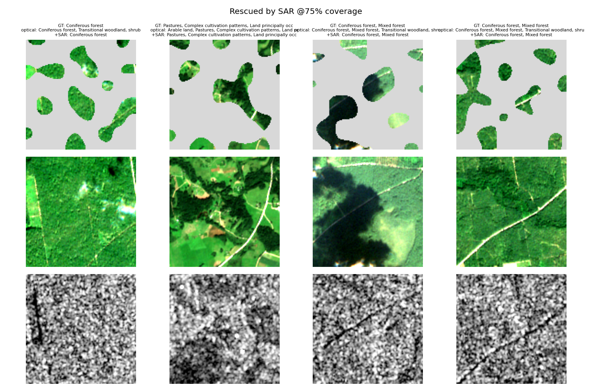

# SAR-Assisted Land-Cover Understanding under Degraded Optical Conditions

**Case study submission — Blurgs.ai**

Investigating whether Sentinel-1 SAR provides useful information for land-cover classification
when Sentinel-2 optical observations are partially unavailable (cloud-obscured).

Everything lives in one reproducible notebook: [`sar_assisted_landcover.ipynb`](sar_assisted_landcover.ipynb).

---

## 1. Problem understanding

Optical satellite imagery is easy to interpret but frequently unusable — clouds obscure a large
fraction of Sentinel-2 acquisitions. SAR penetrates cloud, but its C-band backscatter measures
surface roughness and geometry rather than reflectance, so it is informative for some land-cover
types and nearly useless for others. The practical question is therefore not *"is SAR as good as
optical?"* (it is not) but **"when optical degrades, how much does SAR recover, and for what?"**

I framed this as **multi-label land-cover classification** on paired Sentinel-1/Sentinel-2
patches, evaluated under three conditions at six levels of simulated cloud coverage:

| Condition | Input |
|---|---|
| **A. Optical only** | clean Sentinel-2 (12 bands) |
| **B. Degraded optical** | Sentinel-2 with simulated cloud masks |
| **C. Degraded optical + SAR** | masked Sentinel-2 together with Sentinel-1 (VV, VH) |

Multi-label (not single-label) is the faithful formulation, and I checked this against the data
rather than assuming it: a BigEarthNet patch covers 1.2 × 1.2 km and here carries a median of 4
co-occurring classes. Forcing a strict single-label formulation would keep only **1,533 of 8,774
patches (17.5%)**, and those survivors are degenerate — 1,326 of them are *Marine waters*, with
six of the eleven classes left in single digits. So: multi-label, sigmoid outputs, BCE loss,
macro-F1 as the headline metric. (Reproduced in notebook §3.)

## 2. Dataset

[`hackelle/BigEarthNetV2-Lithuania-Summer-LMDB`](https://huggingface.co/datasets/hackelle/BigEarthNetV2-Lithuania-Summer-LMDB)
— an LMDB conversion of the official **BigEarthNet v2.0 (reBEN)** archive, filtered to Lithuania
summer acquisitions, published by a member of the original BigEarthNet team (TU Berlin RSiM).
8,775 paired S1/S2 patches (~2.4 GB), with the official train/validation/test splits preserved.

Chosen because it is a genuine BigEarthNet subset with **paired S1+S2 and official splits**, at a
size that fits comfortably on one laptop GPU — the full archive is 549,488 patches / ~180 GB.

**Inspection and cleaning** (notebook §3–4):

- Dropped patches flagged `contains_cloud_or_shadow` / `contains_seasonal_snow` so that all
  degradation in the experiment is the controlled kind (this subset contains zero — the optical
  baseline really is cloud-free).
- Kept the **11 classes with ≥ 1,000 positive patches**; the other 6 have < 350 positives (some
  < 100) and cannot be trained or evaluated reliably at this scale. Exactly one patch had no
  positive among the 11, leaving **8,774** of 8,775.
- Bands arrive at native resolution (10 m → 120², 20 m → 60², 60 m → 20²); all are bilinearly
  resampled to the common 120×120 10 m grid and cached as `float16` memmaps.
- Normalisation statistics computed on the **training split only**.

| split | patches |
|---|---|
| train | 4,205 |
| validation | 2,418 |
| test | 2,151 |

## 3. Simulated cloud degradation

Real clouds are spatially correlated blobs, not random pixels. Masks are generated by
thresholding smoothed Gaussian noise (bicubic-upsampled 8×8 → 120×120) at the quantile matching
the requested coverage, giving cumulus-like shapes with exact coverage control at
**0 / 25 / 50 / 75 / 90 / 100 %**.

Two properties make the comparison scientifically valid:

- **Evaluation masks are deterministic**, seeded by `(SEED, coverage level, patch index)`. Every
  model, at every re-run, sees *pixel-identical* degradation → all comparisons are paired.
- **Training masks are random** (50% of samples left clean, otherwise coverage ~ U(0.1, 0.95)).

Masked pixels are set to zero **after** standardisation, i.e. to the per-band mean — the
least-informative value. SAR is never masked; that is the premise under test.

## 4. Approach

### Baseline (required minimum)
A simple 4-block CNN (~1.2 M params) on clean Sentinel-2, then evaluated under masking it never
saw during training. This is **model A**, and it establishes the brittleness the rest of the
study addresses.

### Considered approaches
The contribution is a **4 architecture × 3 fusion-variant matrix**, all trained with an identical
regime (AdamW, cosine schedule, class-balanced BCE, mixed precision, 30 epochs, best-validation
checkpointing, same seed):

| Fusion variant | Description |
|---|---|
| **B** | optical only, trained with mask augmentation (fair degraded-optical reference) |
| **C** | **early fusion** — SAR concatenated as extra input channels (12 → 14) |
| **D** | **late fusion** — separate optical/SAR encoders, features concatenated before the head |

| Architecture family | Notes |
|---|---|
| SimpleCNN | 4 conv blocks, ~1.2 M params — the baseline |
| VGG11 | VGG-11-with-BN style plain stacks, ~9.2 M |
| ResNet18 (scratch) | residual encoder, ~11.2 M |
| ResNet18 (pretrained) | torchvision ImageNet weights; stem rebuilt for 12/14 bands by channel-averaging the RGB kernels; new head; LR 3·10⁻⁴ |

Plus two extras:

- **Model H — selective per-class fusion.** Exploits the fact that SAR helps some classes and
  hurts others: for each class and coverage level it takes the SAR model's probability *only if
  that model beats the optical model on the **validation** split*, else the optical model's.
- **Capacity sweep.** Each of VGG11 and ResNet18 retrained at ¼ and ½ width to test whether the
  larger architectures' failure to beat the baseline is an overfitting problem.

## 5. Evaluation methodology

Metrics: **macro-F1** (primary — insensitive to class imbalance), **mAP** (threshold-free),
**label accuracy** (per-label binary accuracy) and **subset accuracy** (exact match, strictest).
Reference points on the test split: predicting *always negative* scores 0.000 macro-F1 but 0.639
label accuracy, and *always positive* scores 0.504 macro-F1 — so macro-F1's meaningful range here
is roughly 0.50–1.00, and label accuracy's is 0.64–1.00.
The decision threshold is fixed at 0.5 throughout — deliberately untuned.

Three layers of rigour, because the effects being measured are small:

1. **Paired evaluation** — identical deterministic masks per patch across all models and levels.
2. **Paired bootstrap CIs** — 1,000 resamples of the test set, *shared across models*, so every
   reported delta comes with a 95% interval. (Computed in closed form from per-class TP/FP/FN
   counts, so the whole matrix costs seconds.)
3. **Seed replicates** — B, C and D retrained with seeds 43 and 44, evaluation masks held fixed,
   isolating training stochasticity.

No leakage: official splits, train-only normalisation statistics, model H's per-class selection
made on validation only, no threshold tuning, one fixed fine-tuning learning rate.

## 6. Results

Test-set macro-F1 (full tables for all 13 models and all four metrics are in the notebook and
[`data/processed/results.csv`](data/processed/results.csv)):

| coverage | A: clean-trained | SimpleCNN B | SimpleCNN C | SimpleCNN D | VGG11 B | VGG11 C | **VGG11 D** | H: selective |
|---|---|---|---|---|---|---|---|---|
| 0% | **0.753** | 0.750 | 0.751 | 0.751 | 0.746 | 0.752 | 0.750 | 0.752 |
| 25% | 0.705 | 0.746 | 0.749 | 0.746 | 0.746 | 0.750 | 0.750 | 0.745 |
| 50% | 0.633 | 0.747 | 0.741 | 0.744 | 0.740 | 0.747 | 0.747 | 0.746 |
| 75% | 0.412 | 0.730 | 0.733 | 0.735 | 0.730 | 0.738 | **0.741** | 0.738 |
| 90% | 0.255 | 0.714 | 0.723 | 0.723 | 0.707 | 0.728 | **0.733** | 0.726 |
| 100% | 0.118 | 0.330 | **0.711** | 0.639 | 0.000 | 0.711 | 0.551 | 0.675 |

### Finding 1 — the clean-trained baseline is brittle
Model A collapses from 0.753 to 0.412 macro-F1 at 75% coverage. This is **distribution shift, not
information loss** — model B, the same architecture trained with mask augmentation, reaches 0.730
on the very same masked inputs.

### Finding 2 — mask augmentation alone recovers most of the loss
With only 10% of pixels visible, model B still scores 0.714 (vs 0.750 clean). Scene-level labels
over 1.2 km are spatially redundant, which limits how much headroom SAR has under *partial* cloud.

### Finding 3 — SAR's benefit is real but concentrated at heavy occlusion
Confirmed against both noise sources: significant by paired bootstrap at 90% coverage, and the
paired SAR deltas are positive in **all 6 of 6** paired comparisons (2 SAR models × 3 seeds) at both 75% and 90%. At 100%
coverage the effect is decisive — SAR-assisted models hold ~0.71 (≈ 95% of clean-optical
performance) while every optical-only model collapses to label-prior guessing.
**SAR is insurance against near-total optical loss**, not a booster under light cloud.

### Finding 4 — architecture matters exactly where the task is hard
No architecture beats SimpleCNN on optical-only at any coverage level. But **VGG11 extracts
significant SAR gains from 50% coverage upward** (+0.7 to +2.5 pts) where SimpleCNN could not,
and VGG11-D is the best model in the study in the degraded regime. Fusing two modalities under
occlusion is the one genuinely hard sub-task here, and it is the only place richer features pay.

### Finding 5 — the macro average hides opposite class-level effects
Grouping classes by expected C-band signature (notebook §9):

| group | SAR effect (Δ F1 vs optical-only) |
|---|---|
| **Water** (specular → very low backscatter) | **significantly positive at every level ≥ 25%**: +1.4 → +3.3 → +6.3 pts at 25/75/90%, +88.7 at 100% |
| **Urban** (double-bounce → very high backscatter) | positive at 75–90% (+1.3, +1.8), +21 at 100%; underpowered (265 test positives) |
| **Agriculture** | **significantly negative at 90%** (−1.3 pts) |
| **Forest & shrub** | ≈ 0 until total occlusion |

The small macro-average gains are literally *water gains minus agriculture losses*. Acting on
this — model H, which routes per class using validation only — beats **both** of its parents
significantly at 75%, 90% and 100% coverage.

At 75% coverage this is what the study is ultimately measuring: the best SAR-assisted model gets
**81 test patches exactly right that the best optical-only model gets wrong**, and the failures
that remain are label-ambiguity cases rather than degradation-handling cases.

### Finding 6 — early vs late fusion is a genuine trade-off
Late fusion is slightly better under partial cloud; **early fusion is much better at total
optical loss** in all four families (e.g. SimpleCNN 0.711 vs 0.639; VGG 0.711 vs 0.551). A shared
trunk can re-purpose its full capacity for SAR when optical is zeroed, whereas a dedicated SAR
branch trains on weak gradients whenever optical is visible.

### Finding 7 — capacity is not the bottleneck, and shrinking does not fix it either
ImageNet-pretrained ResNet-18 is significantly *worse* than the 1.2 M-param baseline everywhere
(−2 to −3.8 pts): RGB natural-image features transfer poorly to 12-band multispectral, and it
memorised the training set by epoch 4. The train-test gap grows monotonically with parameter
count (2.7 → 4.2 → 6.0 pts), which suggested overfitting — so I tested the obvious remedy with a
**capacity sweep**, retraining VGG11 and ResNet18 at ¼ and ½ width.

It failed: **no width of either architecture reaches the SimpleCNN baseline at any coverage
level**, and VGG11 at *half* the baseline's parameter count (0.58 M vs 1.18 M) is still
significantly worse. Parameter count is therefore not the explanatory variable. The likely cause
is the **downsampling schedule versus input size**: on 120 px inputs SimpleCNN reaches global
pooling at 7×7, VGG11 at 3×3, ResNet-18 at 4×4 (its stem discards ×4 resolution before any real
feature extraction). Architectures designed for 224 px ImageNet inputs pool away exactly the
spatial detail that multi-label land cover depends on.

One practical upside: the miniaturised **VGG11-w32 fusion models keep most of the benefit at a
fraction of the cost** — w32-D scores 0.7406 at 75% coverage vs full-size VGG11-D's 0.7407 with
**17× fewer parameters** (2.4 M vs 39.8 M), and beats SimpleCNN significantly at 90%. It does
collapse at 100% coverage (0.350), so the narrow model trades robustness for efficiency.

## 7. Representative successes and failures



At 75% coverage the best SAR-assisted model (VGG11-D, 0.741) exactly matches the full label set
on **81 test patches where the best optical-only model (SimpleCNN-B, 0.730) fails** — raising
strict exact-match accuracy from 11.1% to 12.6%. Rows: masked optical as the model sees it,
clean optical for reference, SAR VV.

- **Successes** cluster where the physics predicts: water bodies and urban structure remain
  visible to radar when the optical view is gone. See also
  [`figures/class_coverage_heatmap.png`](figures/class_coverage_heatmap.png).
- **Failures** ([`figures/failures_cases.png`](figures/failures_cases.png)) — 1,831 test patches
  are wrong under both models, dominated by fine-grained agriculture/forest distinctions
  (*Complex cultivation patterns* vs *Land principally occupied by agriculture*, broad-leaved vs
  mixed forest). These are ambiguous in the **clean** imagery too: they reflect label noise in
  scene-level CORINE-derived annotations rather than a failure of degradation handling.

Other figures: [`coverage_curves.png`](figures/coverage_curves.png) (architecture × fusion),
[`bootstrap_ci.png`](figures/bootstrap_ci.png), [`seed_replicates.png`](figures/seed_replicates.png),
[`group_deltas.png`](figures/group_deltas.png), [`capacity_sweep.png`](figures/capacity_sweep.png),
[`masks.png`](figures/masks.png), [`training_curves.png`](figures/training_curves.png).

## 8. Limitations and what I would try next

**Limitations.** Masks fill with the band mean, which simulates *thick* cloud; thin cloud, haze
and cloud shadow corrupt rather than remove signal and are harder. No model trains on 100%
coverage, so that column is an extrapolation for every model. The subset is one country and one
season. Labels are scene-level and noisy. Urban conclusions rest on 265 test positives. VGG
results come from a single seed. With ~90 bootstrap tests at 95%, ~4–5 false positives are
expected, so only effects consistent across levels, families or seeds are relied upon.

**Next steps, in order of expected value:**

1. **Fix the resolution mismatch** — remove one pooling stage from VGG11 / use a stride-1 stem for
   ResNet so they reach global pooling at 7×7 like the baseline. This directly tests Finding 7 and
   is cheap.
2. **Domain-specific pretraining** (SSL4EO-S12, BigEarthNet-pretrained encoders) instead of
   ImageNet — the right way to spend capacity given Finding 7.
3. **Mask as an explicit input channel**, and a **learned gate** that combines late fusion's
   partial-cloud strength with early fusion's total-loss robustness — i.e. learn end-to-end what
   model H does by hand.
4. **Cross-modal distillation** — regress SAR features onto clean-optical features so the SAR
   branch inherits optical-like semantics for the fully-clouded case.
5. **Real cloud degradation** — overlay genuinely cloudy Sentinel-2 acquisitions (and their
   shadows) instead of synthetic blobs.
6. **Scale up** — full 19-class reBEN across countries and seasons; with 130× more data the
   deeper architectures should finally earn their parameters.
7. Geometric augmentation (flips, 90° rotations) — label-preserving for top-down imagery, absent
   here, and the cheapest missing regulariser.

## 9. Reproducing

```bash
pip install torch torchvision --index-url https://download.pytorch.org/whl/cu128
pip install -r requirements.txt
jupyter lab sar_assisted_landcover.ipynb      # or: python -m nbconvert --to notebook --execute --inplace sar_assisted_landcover.ipynb
```

Run the cells top to bottom. The notebook downloads the dataset (~2.4 GB), builds ~3.4 GB of
preprocessed memmaps, then trains. Every stage is cached: the download, the memmaps, the
normalisation statistics and every model checkpoint are skipped if present.

**Because all 28 checkpoints are committed, a fresh clone skips training entirely** — the
notebook loads them and goes straight to evaluation and analysis (a few minutes). Set
`FORCE_RETRAIN = True` in §1 to retrain everything from scratch instead.

Hardware used: RTX 4060 Laptop (8 GB), 16 GB RAM, Windows 11, Python 3.13.
Training all 27 runs from scratch takes roughly 7 hours; evaluation and analysis take minutes.
Results are seed-controlled and reproduce exactly on the same hardware.

## 10. Repository layout

```
sar_assisted_landcover.ipynb        the complete study (executed, with all outputs)
README.md                           this file
requirements.txt                    pinned environment
history/                            every earlier notebook version, executed, + HISTORY.md
  v1_baseline_A_B_C.ipynb             iteration 1: baseline + first SAR comparison
  v2_late_fusion_and_bootstrap.ipynb  iteration 2: bootstrap CIs, late fusion, deep model
  v3_seeds_class_conditional_hybrid.ipynb  iteration 3: seed replicates, class analysis, hybrid
  v4_architecture_matrix.ipynb        iteration 4: full 4x3 architecture matrix
figures/                            all 12 generated figures
data/processed/                     all outputs of the study:
  *.pt                                28 trained model checkpoints (~490 MB, all committed)
  experiment_inventory.csv            index of all 25 training runs (750 epochs total)
  results.csv, bootstrap_ci.csv, ...  every metric table, including superseded iterations
  *_history.csv                       per-epoch training curves for every run
data/BENv2_lithuania_summer/        (git-ignored) the downloaded dataset, ~2.4 GB
data/processed/*.npy                (git-ignored) preprocessed memmaps, ~3.4 GB
```

**Nothing is cherry-picked.** All 28 checkpoints are committed — including the models that lost
(ImageNet-pretrained, the deep scratch-ResNet, the narrowed architectures) and the superseded
14-epoch versions of A/B/C from the first iteration. The only exclusions are the downloaded
dataset and the preprocessed arrays, both of which the notebook regenerates automatically; every
artefact that represents *work done* is in the repository.

Note for cloning: the repo is ~510 MB because of the checkpoints. `git clone --filter=blob:none`
fetches history without the weights if you only want the code and results.

## 11. Project history — every iteration

The study was built in five passes, each fully executed before being superseded. Full narrative
with the numbers each version produced: [`history/HISTORY.md`](history/HISTORY.md).

| Version | What it added | Key outcome |
|---|---|---|
| **v1** | baseline A, mask-augmented B, early-fusion C; 14 → 30 epochs | A collapses under masking; C only clearly wins at 100% coverage. The 50% gap flipped sign between the 14- and 30-epoch runs → motivated real statistics |
| **v2** | paired bootstrap CIs; late fusion D; deep dual-encoder E | SAR significant only at ≥90%; **E significantly worse than the small baseline** — first hint capacity wasn't the issue |
| **v3** | seed replicates; class-conditional analysis; selective fusion H | SAR deltas positive in 6/6 paired comparisons across seeds; **water helped at every level ≥25%, agriculture hurt at 90%** — the macro average was hiding opposite effects |
| **v4** | VGG11, ResNet18-scratch, ImageNet-pretrained ResNet18 × B/C/D; accuracy metrics | **VGG11 unlocked significant SAR gains from 50% upward**; ImageNet pretraining failed outright |
| **final** | capacity diagnosis + width sweep; formulation evidence; experiment inventory | Shrinking the architectures made them **monotonically worse** → the problem is the downsampling schedule vs 120 px inputs, not parameter count |

Superseded result files are kept deliberately: `results_14ep.csv` (iteration 1, undertrained)
and `results_30ep_3models.csv` (iteration 2) sit alongside the final `results.csv`.

## 12. External resources used

- **Dataset**: BigEarthNet v2.0 (reBEN) — Clasen et al., *"reBEN: Refined BigEarthNet Dataset for
  Remote Sensing Image Analysis"*, 2024; accessed via the LMDB conversion
  [`hackelle/BigEarthNetV2-Lithuania-Summer-LMDB`](https://huggingface.co/datasets/hackelle/BigEarthNetV2-Lithuania-Summer-LMDB).
- **Pretrained weights**: torchvision `ResNet18_Weights.IMAGENET1K_V1` (ImageNet-1k) — used only
  for the pretrained family, and reported as a negative result.
- **Libraries**: PyTorch, torchvision, NumPy, pandas, SciPy, scikit-learn, matplotlib, lmdb,
  safetensors, huggingface-hub.
- All model architectures (SimpleCNN, VGG11-style, ResNet18-style, fusion variants), the cloud
  simulation, the evaluation protocol and the analysis code were written for this exercise.
